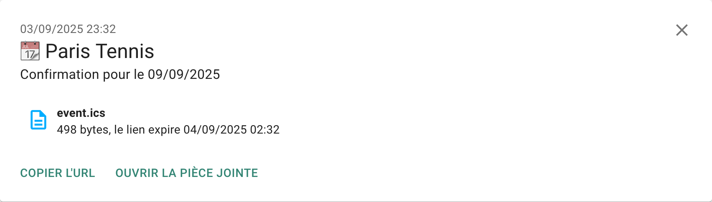

# par-ici-tennis (*Parisii tennis*)

Script to automatically book a tennis court (on https://tennis.paris.fr)

> "Par ici" mean "this way" in french. The "Parisii" were a Gallic tribe that dwelt on the banks of the river Seine. They lived on lands now occupied by the modern city of Paris. The project name can be interpreted as "For a Parisian tennis, follow this way"

**NOTE**: They recently added a CAPTCHA during reservation process. The latest version **should** pass through. If it fails, open an issue with error logs, I will try to find an other way.

## Table of Contents

- [Prerequisites](#prerequisites)
- [Get started](#get-started)
  - [Configuration](#configuration)
  - [Ntfy notifications (optional)](#ntfy-notifications-optional)
  - [AI CAPTCHA solver (optional)](#ai-captcha-solver-optional)
  - [Payment process](#payment-process)
  - [Running](#running)
- [Contributing](#contributing)
- [License](#license)

## Prerequisites
- Node.js >= 20.6.x
- A "carnet de réservation" in your Paris Tennis account (see [Payment process](#payment-process)) 

## Get started

### Configuration

Create `config.json` file from `config.json.sample` and complete with your preferences.

- `location`: a list of courts ordered by preference - [full list](https://tennis.paris.fr/tennis/jsp/site/Portal.jsp?page=tennisParisien&view=les_tennis_parisiens)

You can use two formats for the `locations` field:

1) **Array format:**
  ```json
  "locations": [
    "Valeyre",
    "Suzanne Lenglen",
    "Poliveau"
  ]
  ```
  Use this if you want to search all courts at each location, in order of preference.

2) **Object format (with court numbers):**
  ```json
  "locations": {
    "Suzanne Lenglen": [5, 7, 11],
    "Henry de Montherlant": []
  }
  ```
  Use this if you want to specify court numbers for each location. An empty array means all courts at that location will be considered.

Choose the format that best matches your preferences.

- `date` a string representing a date formated D/M/YYYY, if not set the date 6 days in future is used

- `hours` a list of hours ordered by preference

- `priceType` an array containing price type you can book `Tarif plein` and/or `Tarif réduit`

- `courtType` an array containing court type you can book `Découvert` and/or `Couvert`

- `players` list of players 3 max (without you)

### Ntfy notifications (optional)

You can configure the script to send notifications with the reservation details and the ics file via [ntfy](https://ntfy.sh), a simple pub-sub notification service.

To receive notifications:
- Choose a unique topic name (e.g., `YOUR-UNIQUE-TOPIC-NAME` choose something unique to avoid conflicts and complex because there is no password for subscription)
- Subscribe to your topic using the [ntfy mobile app](https://ntfy.sh/docs/subscribe/phone/) or [web interface](https://ntfy.sh/)

To enable ntfy notifications in script, add the following configuration to your `config.json`:

```json
"ntfy": {
  "enable": true,
  "topic": "YOUR-UNIQUE-TOPIC-NAME"
}
```

Configuration options:
- `enable`: set to `true` to enable ntfy notifications
- `topic`: your unique ntfy topic name choose previously
- `domain` (optional): custom ntfy server domain (`ntfy.sh` used if empty)

Notification example:



### AI CAPTCHA solver (optional)

The script uses an AI model to automatically solve CAPTCHAs during the reservation process. By default, it uses a Hugging Face Space, but you can configure a custom one if the default one is down.

You can find alternative spaces here https://huggingface.co/spaces, search `Text_Captcha_breaker` and select a running space. To use it, add the following configuration at the end of your `config.json`:

```json
"ai": {
  "space": "hf-username/Text_Captcha_breaker"
}
```

**Note**: The custom space must be compatible with the expected API format (accepting an image input and returning text output), that why you need to select a `Text_Captcha_breaker` space.

### Payment process

To pass the payement phase without trouble you need a "carnet de réservation", be carefull you need a "carnet" that maches with your `priceType` & `courtType` [combination](https://tennis.paris.fr/tennis/jsp/site/Portal.jsp?page=rate&view=les_tarifs) selected previously

### Running

#### Local Execution

To run this project locally, install the dependencies

```sh
npm install
```

and run the script:

```sh
npm start
```

To test your configuration, you can run this project in dry-run mode. It will check court availability but no reservations will be made:

> [!IMPORTANT]
> due to a bug on the booking website, it is temporarily impossible to cancel a booking before final payment. The dry-run is therefore non-functional, and the command has been deactivated to avoid leaving an unsuccessful order. You can still try out using the classic launch command `npm start`, but you'll have to cancel the reservation manually (possible up to 24 hours before the reservation date).

```sh
npm run start-dry
```

#### Automated Execution with GitHub Actions

You can automatically run this script daily at 8 AM using GitHub Actions. This is perfect for weekly court booking without needing to keep your computer running.

**Setup Instructions:**

1. **Fork/Push this repository to GitHub**

2. **Configure GitHub Secrets:**
   Go to your repository Settings → Secrets and variables → Actions → New repository secret

   Required secrets:
   - `TENNIS_EMAIL`: Your tennis.paris.fr account email
   - `TENNIS_PASSWORD`: Your tennis.paris.fr account password
   
   Optional secrets (with defaults):
   - `TENNIS_LOCATIONS`: Array of preferred locations, e.g., `["Valeyre", "Suzanne Lenglen"]`
   - `TENNIS_HOURS`: Array of preferred hours, e.g., `["14", "15", "16"]`
   - `TENNIS_PLAYERS`: Array of player objects, e.g., `[{"lastName": "Doe", "firstName": "John"}]`
   - `TENNIS_PRICE_TYPE`: Array of price types, e.g., `["Tarif plein", "Tarif réduit"]`
   - `TENNIS_COURT_TYPE`: Array of court types, e.g., `["Découvert", "Couvert"]`
   - `NTFY_ENABLE`: Set to `true` to enable ntfy notifications
   - `NTFY_TOPIC`: Your ntfy topic name for notifications

3. **Configure the schedule:**
   The workflow runs daily at 8:00 AM UTC by default. To adjust for your timezone, edit `.github/workflows/book-tennis.yml`:
   - For 8 AM EST (Eastern): use `13 8 * * *` (UTC+5)
   - For 8 AM PST (Pacific): use `16 8 * * *` (UTC+8)
   - For 8 AM CET (Central European): use `7 8 * * *` (UTC-1)

4. **Manual trigger (optional):**
   You can manually trigger the workflow from the Actions tab → "Book Tennis Court" → "Run workflow"

5. **Monitor execution:**
   - View workflow runs in the Actions tab
   - Failed runs will upload screenshots as artifacts for debugging

**Note:** GitHub Actions runs in UTC timezone, so adjust the cron schedule accordingly. The script will book courts 6 days in advance by default.

You can also start script automatically using cron or equivalent on your local machine

## Contributing

Contributions and bug reports are welcome! Please open an [issue](https://github.com/bertrandda/par-ici-tennis/issues) or submit a [pull request](https://github.com/bertrandda/par-ici-tennis/pulls).

## License

MIT